<div align="center">



# ⚙️ UNI Rolling Bearing Generator

**Parametric, standard-compliant rolling bearings — one geometry core, two hosts.**
<br>
<sub>Parametric standard rolling bearings for <b>Blender</b> &amp; <b>FreeCAD</b> from a single shared core.</sub>

<br>

[](https://github.com/Chance-Konstruktion/Uni-rolling-bearing/actions/workflows/tests.yml)


[🇬🇧 English](README.md) · **[🇩🇪 Deutsch](README.de.md)**

[**Quick Start**](#quick-start) · [**Architecture**](#architecture) · [**Bearing types**](#bearing-types) · [**FreeCAD**](#freecad) · [Changelog](CHANGELOG.md) · [Roadmap](ROADMAP.md)

</div>

---

## What is this? 🎯

A generator for **functional rolling bearings** (ball, cylindrical, needle, tapered,
barrel/spherical and U-groove bearings) — operated through a **Blender N-panel** *and* a
**FreeCAD workbench**. Both hosts share the same `bpy`-/`FreeCAD`-free geometry core, so they
compute *identically* — Blender produces a mesh, FreeCAD an exportable BREP solid.

> 💡 **In short:** You enter `d · D · B`, choose the bearing type — and get a
> standards-oriented, collision-free bearing with real raceways, rolling elements and an
> optional cage.

<table>
<tr>
<td width="33%" valign="top">

### 📐 Standard-compliant
ISO 15 dimension series, DIN 623/625/720/635, ISO 492 tolerances and DIN 5418 fits — as presets *and* live calculation.

</td>
<td width="33%" valign="top">

### 🧩 Functional
Auto-fit limits rolling-element Ø &amp; count to plausible values. No clipping balls, no colliding rollers, manifold-ready geometry.

</td>
<td width="33%" valign="top">

### 🔗 Two hosts
One host-free core → Blender mesh **and** FreeCAD solid. STEP/IGES export natively through FreeCAD, no bridge required.

</td>
</tr>
</table>

---

## Highlights ✨

<table>
<tr>
<td width="50%">

🧱 **6 bearing types** — deep-groove ball, cylindrical, needle, tapered, barrel/spherical, U-groove (SG)

</td>
<td width="50%">

📐 **Standards basis** — ISO 15 · DIN 623/625/720 · ISO 492/76/281 · DIN 5418

</td>
</tr>
<tr>
<td>

🔩 **Real raceways** — groove arcs, conical apex geometry, spheres

</td>
<td>

⚖️ **Load ratings live** — `C0r`, `Cr`, `P`, `L10h` straight in the panel

</td>
</tr>
<tr>
<td>

🛟 **Cage** — pocket · solid · ribbon · ladder (boolean pockets)

</td>
<td>

🧮 **Auto-fit** — silently corrects implausible combinations

</td>
</tr>
<tr>
<td>

📦 **STEP / IGES** — natively via FreeCAD BREP solids

</td>
<td>

🧪 **202 tests** — host-free, run without Blender/FreeCAD

</td>
</tr>
</table>

---

## Architecture 🧩

A **shared geometry core** without `bpy`/`FreeCAD`, two thin frontends:

<pre>
                 ┌───────────────────────────────────────────┐
                 │   uni_rolling_bearing/  ·  CORE (host-free)│
                 │   geometry · raceway · ratings · fits      │
                 │   tolerances · norm_engine · din623        │
                 └───────────────┬───────────────┬────────────┘
                                 │               │
              resolve_geometry() │               │ build_plan()
                                 ▼               ▼
                 ┌───────────────────┐   ┌────────────────────────┐
                 │  Blender frontend │   │  FreeCAD frontend       │
                 │  mesh_builders    │   │  freecad_backend/       │
                 │  operators·panel  │   │  plan · backend · ui    │
                 │  → BMesh objects  │   │  → Part BREP solids     │
                 └───────────────────┘   └────────────────────────┘
                          │                         │
                       🟧 Mesh                  🟦 Solid → STEP/IGES
</pre>

<details>
<summary><b>Full module structure</b></summary>

```
uni_rolling_bearing/      # Shared core + Blender frontend
├── constants.py       # bearing-type IDs, presets, standard notes          [Core]
├── geometry.py        # pure geometry functions (testable host-free)        [Core]
├── raceway.py         # raceway cross-section profiles (host-free)          [Core]
├── ratings.py · fits.py · tolerances.py · norm_engine.py · din623.py        [Core]
├── mesh_builders.py   # BMesh helpers (rings, revolution, spheres, …)    [Blender]
├── properties.py      # PropertyGroup for the N-panel                    [Blender]
├── operators.py       # create/preset operators                          [Blender]
└── panel.py           # N-panel UI                                       [Blender]

freecad_backend/          # FreeCAD frontend (uses the same core)
├── params.py          # host-free BearingParams (mirrors the UI)
├── plan.py            # host-free BearingPlan (profiles + placements)
├── backend_freecad.py # builds Part solids from the plan (polygon revolve)
├── uischema.py        # host-free property schema + visibility rules
└── workbench/
    ├── wb_bearing.py  # Part::FeaturePython proxy (live rebuild, editor)
    ├── wb_commands.py # GUI command "Create bearing"
    └── icons/         # workbench icon
InitGui.py · package.xml  # FreeCAD workbench discovery (repo root)
```

The core imports **neither** `bpy` **nor** `FreeCAD` — both frontends call the same
geometry. That is why all tests run without an installed host.
</details>

---

## Quick Start 🚀

### ▶ Blender

1. **Get the ZIP** — prebuilt at [`dist/uni_rolling_bearing.zip`](dist/uni_rolling_bearing.zip) (or build it yourself, see below).
2. **Install** — `Edit > Preferences > Add-ons > Install…`, choose the ZIP, tick the checkbox.
3. **Open** — in the 3D view press `N`, tab **UNI Bearings** → pick a bearing type → **Create**.

```bash
python build_addon_zip.py        # writes dist/uni_rolling_bearing.zip
```

### ⬡ FreeCAD

1. **Drop in the Mod** — place the repo as a Mod folder under `Mod/` (or via the Addon Manager); `InitGui.py` + `package.xml` live in the root for this.
2. **Restart** — the workbench **"UNI Bearings"** appears in the dropdown.
3. **Build** — button **"Create bearing"**; all parameters live in the property editor and rebuild the bearing **live**.

```python
# The geometry is also usable purely programmatically (requires FreeCAD):
from freecad_backend.params import BearingParams
from freecad_backend.backend_freecad import build_bearing

p = BearingParams(bearing_type="BALL", bore_diameter=20, outer_diameter=47, width=14)
p.apply_suggested_defaults()
result = build_bearing(p)        # result.inner_ring / .outer_ring / .elements …
```

> 💡 **Not a CAD pro?** Leave **Auto-fit** on and pick a preset (e.g. `6204`). That always
> yields a clean, functional bearing — even without detailed knowledge.

---

## Bearing types 🧱

| Type | Standard | Distinctive feature |
| :-- | :-- | :-- |
| **Deep-groove ball bearing** | DIN 625 / ISO 15 | ball per DIN 625 groove formula, sinks into both grooves |
| **Cylindrical roller bearing** | DIN 5412 / ISO 15 | NU design with flanges on the outer ring, ~94 % gap fill |
| **Needle bearing** | DIN 617 / ISO 15 | slim rollers, high fill ratio |
| **Tapered roller bearing** | DIN 720 / ISO 355 | conical raceways with a common apex, adjustable α |
| **Barrel/spherical roller bearing** | DIN 635-1/-2 | single or double row, spherical outer raceway |
| **U-groove ball bearing (SG)** | SG/W series | guide roller with V/U groove in the outer shell |

<details>
<summary><b>Raceways in detail</b> — how the rolling elements sit</summary>

<br>

- **Ball bearings** — groove arc with conformity `f = r_groove/d_ball` in both rings.
  Ball Ø per the **DIN 625 groove formula**: `d_w = shoulder gap + inner + outer
  groove depth − bearing clearance` (`geometry.ball_diameter_from_groove`). The ball is
  thus *larger* than the bare shoulder gap and dips over both shoulders into the grooves,
  instead of floating between them. Optional 45° chamfer (DIN 620 / ISO 582 `r_s`,
  `bearing_chamfer_mm`).
- **Cylindrical/needle bearings** — NU outer ring with two inward-protruding flanges;
  inner ring cylindrical. The roller fills the gap fully (~94 %, ring wall `1/8·(D−d)`).
  NU206 → ø≈7.5 mm / 13 rollers instead of the previous ~5.3 mm / 24.
- **Tapered roller bearings** — cup raceway at α, cone raceway flatter at `α − 2β`,
  the roller a true truncated cone (half angle β), tilted by `α − β`. Mean roller Ø
  via `geometry.tapered_roller_diameter` (`d_we ≈ radial_space · cos α`), so the
  inclined roller contacts perpendicular to its axis.
- **Barrel/spherical roller bearings** — single row (DIN 635-1): one barrel per position on
  a concave inner raceway; double row (DIN 635-2): two rows tilted by ±α with a
  centre flange. The outer-ring sphere radius is derived automatically from pitch Ø + rolling-element dimensions.
- **U-groove (SG)** — inside like a deep-groove ball bearing, plus a V/U groove in the outer shell
  (`vgroove_depth_mm`, `vgroove_half_angle_deg`, `vgroove_shape`).

</details>

<details>
<summary><b>Tapered roller bearings: contact angle</b> — common apex</summary>

<br>

α (default 14°) is the inclination of the cup raceway to the bearing axis. For pure rolling
motion the roller and both raceways meet at a **common apex**; from that the tool derives
the half cone angle of the roller:

```
β = ½ · (α − arctan( R_i / R_o · tan α ))
```

→ cone (inner) raceway at `α − 2β`, roller axis at `α − β`. The rollers are tilted as
true truncated cones about the local Y axis *before* being rotated onto the pitch circle.
The apex Z is stored as metadata (`tapered_apex_z_mm`).

</details>

<details>
<summary><b>Cage</b> — pocket · solid · ribbon · ladder</summary>

<br>

Checkbox **Create cage** → its own `Cage` sub-assembly. Designs:

- **Pocket** (default) — one-piece sleeve from which type-appropriate rolling-element punches are
  cut by boolean difference (spherical/cylindrical/conical/barrel-shaped).
- **Solid** — pocket sleeve with radial lubrication-pocket bores (`oil_pocket_diameter_mm`,
  0 = automatic), like machined brass solid cages.
- **Ribbon** — two riveted half rings (pressed-sheet style).
- **Ladder** — fallback on a failed boolean: two end plates + tangential webs.

If there is not enough space (rolling elements fill almost the whole width), the cage is
skipped with a warning.

</details>

<details>
<summary><b>Standards basis &amp; load ratings</b> — what is covered</summary>

<br>

> **Note:** practical starting presets + standards-oriented fields, **not yet** a
> complete digital standards database.

- **ISO 15 / DIN ISO 15** — dimension series as a JSON data source (`norm_engine.py`).
- **DIN 623** — bore-number logic (`din623.py`), ~80 deep-groove ball bearing sizes.
- **DIN 625** — series 60/62/63/64/618/619. **DIN 720** — 302/303/313/320/322/323 with
  separate cone/cup widths.
- **ISO 492 / DIN 620** — classes NORMAL/P6/P5/P4 → µm deviations for d/D/B.
- **DIN 5418** — shaft/housing fits per load case (ISO 286 deviations).
- **ISO 76 / ISO 281** — static/dynamic load rating + L10h live in the panel; `f0`/`fc`
  interpolated via γ = `Dw·cos α / dm`, equivalent load `P = X·Fr + Y·Fa`.

</details>

---

## FreeCAD 🛠️

The project is available as a **FreeCAD workbench** — the same core as in Blender, but
real **BREP solids** instead of a mesh. Solids of revolution are built from **straight
polygon meridians** (no BSpline), so the FreeCAD body hits *exactly* the same nominal
dimensions as the Blender mesh: straight shoulders stay straight, no seam/fillet defect.

The workbench offers a `Part::FeaturePython` proxy with **live rebuild** and a
**context-aware property editor** (only the fields the chosen bearing type actually
uses). From it you can export natively to **STEP/IGES**.

> **As of v0.30:** core, build plan, `Part` backend and the complete workbench GUI are
> implemented and tested host-free. Only the manual cross-check in real FreeCAD is, by
> nature, only verifiable on the host — details in the [Roadmap](ROADMAP.md).

---

## Troubleshooting 🔧

<details>
<summary><b>"Rolling element cuts into the ring" / bearing looks wrong</b></summary>

<br>

Leave **Auto-fit** enabled — it limits `rolling-element Ø` and `count` to plausible values
and resolves the geometry before building. The result section shows whether values were
adjusted.
</details>

<details>
<summary><b>Cage missing in the result</b></summary>

<br>

At a very coarse resolution or with too little space, the boolean cut can fail →
fallback to the **ladder cage**, or the cage is skipped with a warning.
Increase `Resolution segments` or give a little more width/pocket clearance.
</details>

<details>
<summary><b>FreeCAD: workbench does not appear in the dropdown</b></summary>

<br>

`InitGui.py` and `package.xml` must sit in the **root directory** of the Mod folder.
Exclude stale `*.backup` folders in the Mod directory and restart FreeCAD.
</details>

---

## Development 🧪

```bash
# Syntax check (both frontends)
python -m compileall uni_rolling_bearing/ freecad_backend/ InitGui.py

# Unit tests — run without Blender/FreeCAD
python -m unittest discover tests
```

**Limitations:** no FEM/contact mechanics · no complete DIN/ISO coverage of all series ·
load ratings/service life are simplified approximations, not certified design values.

---

## License 📄

GNU General Public License v3.0 — see [`LICENSE`](LICENSE).

<div align="center">
<br>
<sub><b>UNI Rolling Bearing Generator</b> · one core, two hosts · Blender 🟧 + FreeCAD 🟦<br>
Made for mechanical engineering — <i>d · D · B → ready-to-use bearing</i></sub>
</div>
